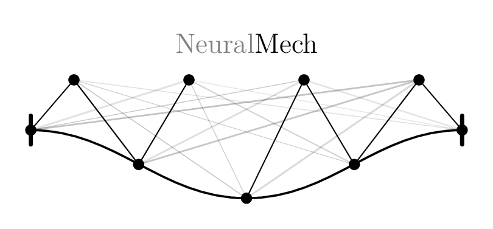
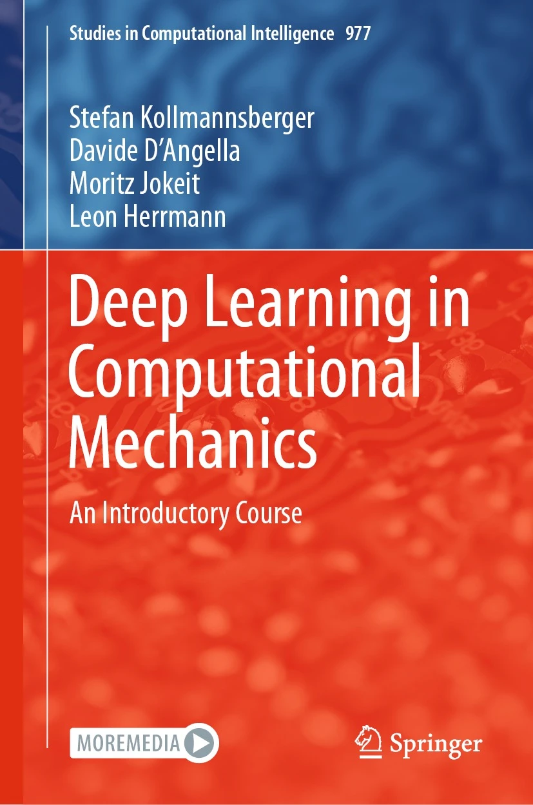
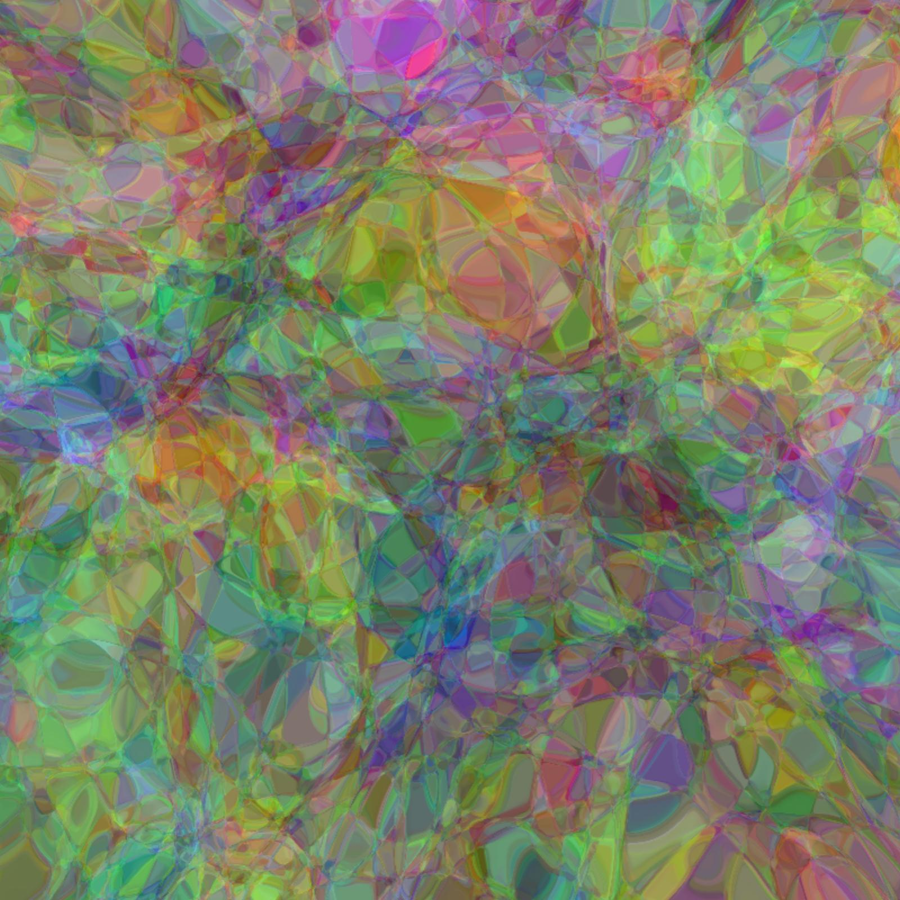
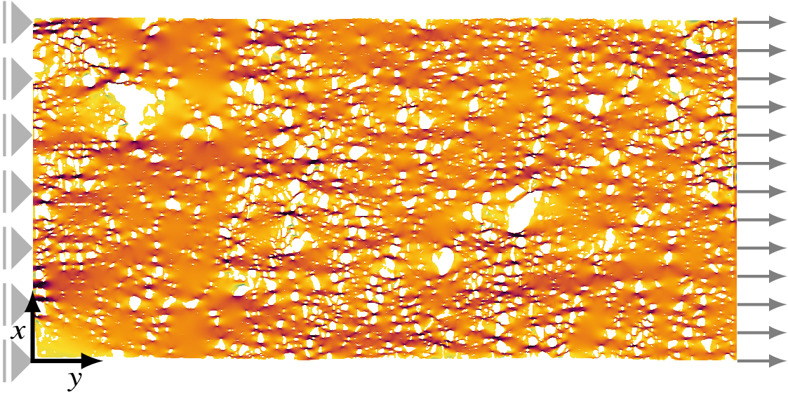
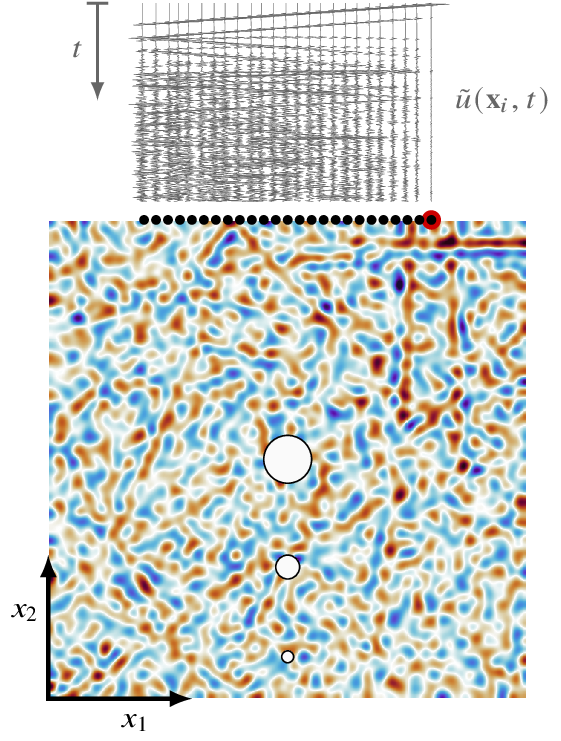

# Deep Learning in Computational Mechanics <br> <small>a comprehensive reference</small>

## About
**neuralmech** is a collection of ml-enhanced physics solvers & optimizers answering
<p align="center"><b><i>When and where is deep learning useful in numerical simulation?</i></b></p>
<p align="center">
  <picture>
    <source media="(prefers-color-scheme: dark)" srcset=".assets/images/logo_dark.png">
    <source media="(prefers-color-scheme: light)" srcset=".assets/images/logo_light.png">
    
  </picture>
</p>

**Features**
- simplistic & extendable implementations
- reproducible results
- associated to the third edition of [**deep learning in computational mechanics**](https://link.springer.com/book/10.1007/978-3-031-89529-6)
<table><tr>
  <td></td>
  <td></td>
</tr></table>

As this project is ongoing, feedback is highly welcome. Finished chapters are available on request under a **personal-use, non-redistribution license** — feel free to reach out via [email](#contact). By requesting a copy, you agree to the license terms included in the document.

<details>
<summary><b>Chapters available on request</b></summary>

- **Fundamental Machine Learning** (chapter 2)
- **Artificial Neural Networks** (chapter 3)



- **Neural Network Architectures** (chapter 4)
- **Probabilistic Machine Learning** (chapter 5)
- **Generative Artificial Intelligence** (chapter 15)
- **Large Language Models** (chapter 17)
- **Simulation Acceleration via GPUs** (chapter 18)



</details>

<details>
<summary><b>Chapters in progress</b></summary>

- **Computational Mechanics Meets Artificial Intelligence** (chapter 1)
- **Machine Learning Algorithms** (chapter 6)
- **Practical Machine Learning** (chapter 7)
- **Governing Equations** (chapter 8)
- **Numerical Methods** (chapter 9)
- **Machine Learning in Computational Mechanics** (chapter 10)
- **Neural Surrogates** (chapter 11)
- **Neural Solvers** (chapter 12)
- **Physics-Informed Neural Networks** (chapter 13)
- **Material Modeling with Neural Networks** (chapter 14)
- **Neural Optimization** (chapter 16)



- **Deep Reinforcement Learning** (chapter 19)
- **Computational Mechanics After Artificial Intelligence** (chapter 20)
</details>

## Requirements
- install via requirements
```
pip install -r requirements.txt
```

### Submodules
[mlhp](https://gitlab.com/hpfem/code/mlhp) is included as git submodule. To clone recursively use
```
git clone --recurse-submodules https://github.com/Leon-Herrmann/neuralmech
```
#### Installation of mlhp
- for now, use `pip install mlhp` (for more advanced physics C++ compilation will be needed)

## Structure
| |                                                                            |
|---|----------------------------------------------------------------------------|
| [`data/`](data/) | generated data (small, but gitignored if large)                            |
| [`external_data/`](external_data/) | data generation tools with data in `data` (large, excluded from main repo) |
| [`models/`](models/) | trained networks                                                           |
| [`results/`](results/) | results for post-processing                                                |
| [`projects/`](projects/) | main drivers; see [projects](projects/README.md)                          |
| [`templates/`](templates/) | elements with repeated use (e.g., `training_loop.py`)                      |
| [`DL.py`](DL.py) | deep learning utilities                                                    |
| [`NN.py`](NN.py) | network architectures                                                      |
| [`postprocessing.py`](postprocessing.py) | postprocessing helpers                                          |
| [`solvers/`](solvers/) | classical physics solvers                                                  |

## Contact
[leon.herrmann@uni-weimar.de](mailto:leon.herrmann@uni-weimar.de)
