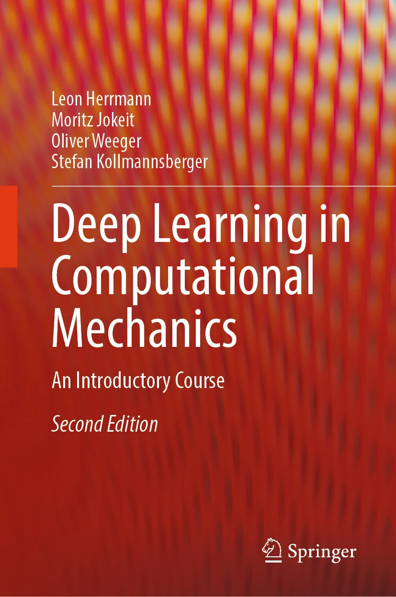

# Deep Learning in Computational Mechanics <br> <small>a comprehensive reference</small>

## about
**neuralmech** is a collection of ml-enhanced physics solvers & optimizers 
- with simplistic but extendable implementations
- reproducible results
- associated to the "3rd" edition of [**deep learning in computational mechancs**](https://link.springer.com/book/10.1007/978-3-031-89529-6)

- 

As project is ongoing, feedback is highly welcome. Finished chapters are available on request. 
Chapters available on request[^1] are
- **fundamental machine learning** (chapter 2)
- **artificial neural networks** (chapter 3)


- **neural network architectures** (chapter 4)
- **probabilistic machine learning** (chapter 5)
- **generative artificial intelligence** (chapter 15)
- **large language models** (chapter 17)
- **simulation acceleration via GPUs** (chapter 18)

[^1]: <leon.herrmann@uni-weimar.de>

Chapters in progress are
- **computational mechanics meets artificial intelligence** (chapter 1)
- **machine learning algorithms** (chapter 6)
- **practical machine learning** (chapter 7)
- **governing equations** (chapter 8)
- **numerical methods** (chapter 9)
- **machine learning in computational mechanics** (chapter 10)
- **neural surrogates** (chapter 11)
- **neural solvers** (chapter 12)
- **physics-informed neural networks** (chapter 13)
- **material modeling with neural networks** (chapter 14)
- **neural optimization** (chapter 16)
- **deep reinforcement learning** (chapter 19)
- **the future of deep learning in computational mechanics** (chapter 20)

## requirements

### submodules
[mlhp](https://gitlab.com/hpfem/code/mlhp) is included as git submodule. To clone recursively use
```
git clone --recurse-submodules https://github.com/Leon-Herrmann/neuralmech
```
#### installation of mlhp
- for now, use `pip install mlhp` (for more advanced physics C++ compilation will be needed)

## main structure
- `data/` - generated data (small, but gitignored if large)
- `external_data/` - data generation tools with data in `data` (large, excluded from main repo)
- `models/` - trained networks
- `results/` - results for post-processing
- `projects/` - main drivers
- `templates/` - elements with repeated use (e.g., `training_loop.py`)
- `DL.py` - deep learning utilities
- `NN.py` - network architectures
- `solvers/` - classical physics solvers

## projects
### chapter 2: ml introduction (`2_intro_ml`)
- `linear_regression.py`
- `logistic_regression.py`
